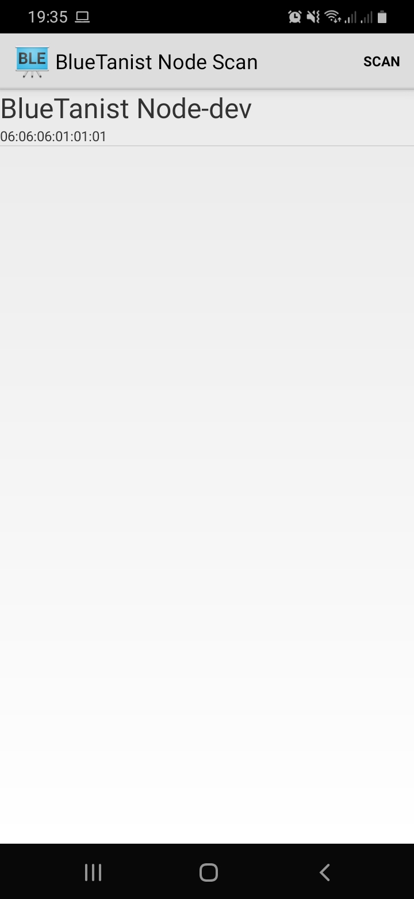
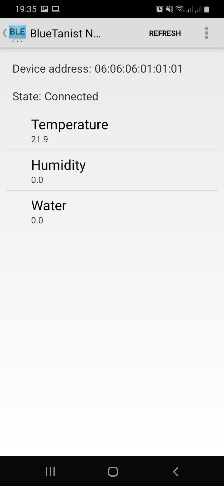

BlueTanist plant monitor
===================================

Based on the android [BluetoothLeGatt][1] sample.

[1]:https://github.com/android/connectivity-samples/tree/master/BluetoothLeGatt

Introduction
------------

This application shows a list of available [BlueTanist monitor devices][2] and provides
an interface to connect and display sensor data.

It creates a [Service][3] for managing connection and data communication with a GATT server
hosted on a given BlueTanist monitor device.

The Activities communicate with the Service, which in turn interacts with the [Bluetooth LE API][4].

[2]:https://github.com/pgils/ble_plant_monitor
[3]:http://developer.android.com/reference/android/app/Service.html
[4]:https://developer.android.com/reference/android/bluetooth/BluetoothGatt.html

Pre-requisites
--------------

- Android SDK 28
- Android Build Tools v28.0.3
- Android Support Repository

Screenshots
-------------

  

Getting Started
---------------

This application uses the Gradle build system. To build this project, use the
"gradlew build" command or use "Import Project" in Android Studio.